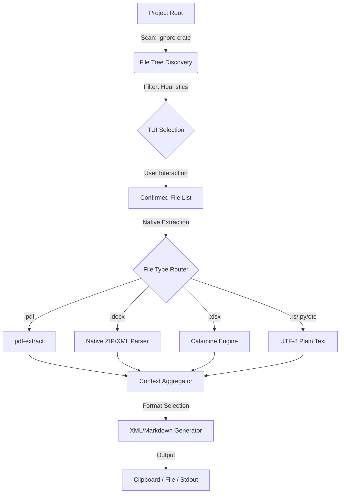

# ARCHITECTURE: NATIVE CONTEXT ENGINE (CLI)

## 1. Core Philosophy
The primary architectural goal is **Absolute Portability**. The software must behave like a "Tank": a single, self-contained binary that executes on any target system (Windows, Linux, macOS) without requiring a pre-installed Python interpreter, Virtual Environments, or external shared libraries (DLLs/SOs).

## 2. Design Evolution
We deliberately moved away from "Architecture for the sake of Architecture."
*   **From Hexagonal to Modular Lean:** We removed unnecessary boilerplate (Traits/Ports) where a direct implementation provided better performance and readability.
*   **From Hybrid to Pure Native:** By replacing Docling (Python) with native Rust crates (`pdf-extract`, `calamine`, `zip`), we eliminated the "Bridge Complexity" and the risk of runtime environment failures.

## 3. System Flow
The following diagram illustrates the linear, robust data pipeline:

## 4. Technical Stack Decisions

| Component | Technology | Technical Justification |
| :--- | :--- | :--- |
| **Language** | Rust 1.80+ | Guarantees memory safety and compiles to a single static binary. |
| **TUI Engine** | `ratatui` | Provides a flicker-free, cross-platform terminal interface. |
| **PDF Parsing** | `pdf-extract` | Pure Rust/Native implementation. No dependency on Poppler or Python. |
| **Office Parsing**| `calamine` + `zip` | High-speed, native XML stream parsing of XLSX/DOCX structures. |
| **Serialization**| `quick-xml` | The fastest XML writer in the ecosystem with low memory footprint. |
| **Persistence** | `serde_json` | Standardized, lightweight state management for user preferences. |

## 5. Data Structures
*   **`FileNode`**: A lightweight pointer to a filesystem entry containing metadata (ignored status, token estimate).
*   **`FileContext`**: The final domain object containing the raw extracted text, language identification, and error reports (if any).

## 6. Interface Design
We simplified the TUI by removing the "Search Mode." This decision was made to ensure the **UI State is always deterministic**. By having a single Navigation/Selection mode, we eliminate keyboard context collisions and ensure the tool is accessible via SSH or low-end terminal emulators.

#### 7. Output Strategy
The system supports two primary formats:
1.  **XML (Structured):** Ideal for LLMs as it provides clear boundaries between file metadata and actual content.
2.  **Markdown (Readable):** Optimized for human review and code-block-aware LLM prompts.
