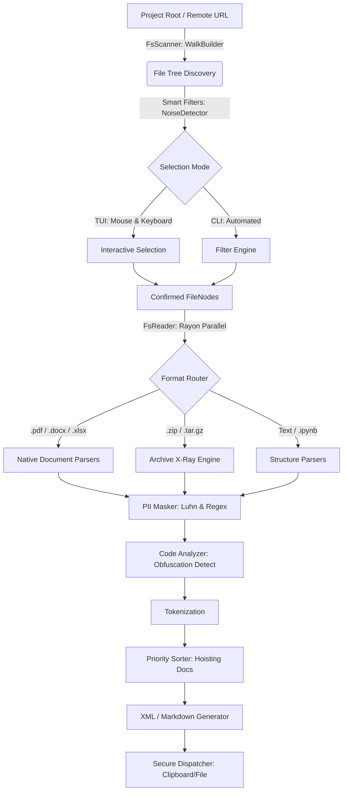

# System Architecture

Context-Dump is structured using a Modular Native Architecture. We deliberately avoid overly abstract patterns (like pure Hexagonal/Ports-and-Adapters) where direct implementation provides better performance and readability, while maintaining clear boundaries between IO and Domain logic.

## System Flow

The application operates as a linear pipeline, transforming file system paths into a single, token-optimized string.

## Core Layers

### 1. The Domain Layer (`src/core/`)
Contains the fundamental data structures that have no dependencies on the outside world.
- `FileNode`: A lightweight pointer to a filesystem entry containing metadata (hidden status, ignored status, token estimate).
- `FileContext`: The final domain object containing the raw extracted text, language identification, and token count.
- `ContextConfig`: The central state object defining rules, limits, and output preferences.

### 2. The Adapter Layer (`src/adapters/`)
Handles interactions with external systems and complex data formats.
- **Scanners:** Uses the `ignore` crate to traverse directories while respecting standard exclusion rules.
- **Parsers:** Pure-Rust implementations that extract raw text from structured binary formats (PDFs, Office docs) and structured JSON (Jupyter Notebooks).
- **Output:** Serializes `FileContext` arrays into LLM-friendly formats (XML, Markdown).

### 3. The Engine Layer (`src/engine/`)
The orchestrator. It uses `rayon` to manage a thread pool, parallelizing the ingestion of files. It connects the `FsScanner` to the `FsReader` and finally to the `OutputDispatcher`.

### 4. The UI Layer (`src/ui/`)
A deterministic, state-driven Terminal User Interface built with `ratatui`. It translates the linear file tree into a navigable, hierarchical visual tree, allowing users to select subsets of a project dynamically.

